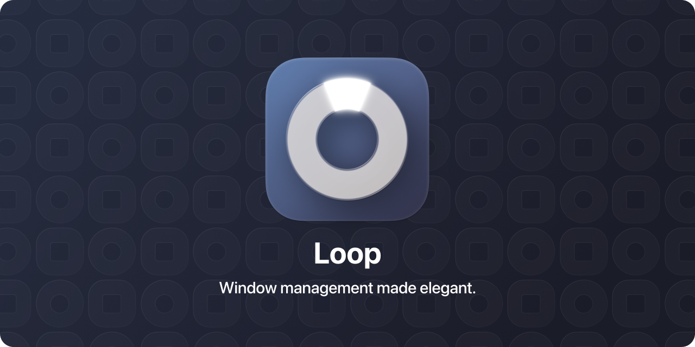
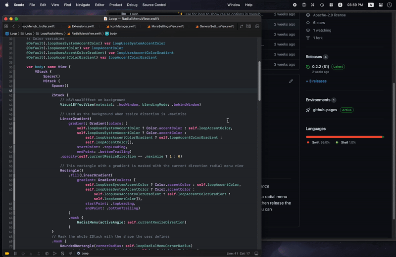

Loop is a MacOS app that simplifies window management for you! You can effortlessly choose your window direction using a radial menu triggered by a simple key press, and customize it according to your preferences with personalized colors and settings. You can easily move, resize, and arrange your windows with just a few clicks, saving you valuable time and energy.

    

# Installation

| :warning: | Loop is currently still in development. You are welcome to test the latest [build](https://github.com/MrKai77/Loop/releases/latest) at your own risk. Please leave any feedback [here](https://github.com/MrKai77/Loop/issues). |
| - |:-|

**Compatible with MacOS 13 and later**

Simply download the latest release [here](https://github.com/MrKai77/Loop/releases/latest)! Simply unzip the file, and open it, and grant it accessibility access!
Installation with Homebrew is planned :3

# Features

- Window resizing with *style*
- Customizable app colors
- Fully customizable radial menu
- Option to change circular menu to rounded rectangle
- Additional keybindings for non-mouse use
- Custom trigger key for Loop
- Unlock new app icons with increased Loop usage

# Usage

1. After installation, launch Loop from your Applications folder.
1. Press the designated hotkey (see [here](#triggering-loop)) to trigger the radial menu.
1. Move your mouse to the direction you want your window to move.
1. Release the hotkey to apply the window movement.
1. To customize Loop's settings, click on the Loop icon in the menu bar and select "Settings". From there, you can customize the hotkey, colors, and other settings to your liking.

That's it! With Loop, window management is a breeze.

# Triggering Loop

You can set your own custom trigger key for Loop! Currently, the available options for triggering loop are:
- `Globe`
- `Right Control` (To use Caps Lock, look [here](#using-caps-lock))
- `Right Option`
- `Right Command`

### Using Caps Lock

To set `Caps Lock` as the trigger key, remap it to `Control` in System Settings, and repeat the process for every connected keyboard. In Loop, make sure the `Right Control` key is selected as your trigger.

# Additional Notes

This project is licensed under the [MIT license](LICENSE).
